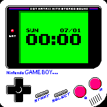

# Bip Watchfaces

Repository with my watchfaces for the Amazfit Bip.

# Gallery



# Install

* Install the [Zeep Life](https://play.google.com/store/apps/details?id=com.xiaomi.hm.health) app and sync your device
* Copy a watchface directory from [watch_skin_local](watch_skin_local)
* Paste to your android storage at `.../Internal shared storage/Android/data/com.xiaomi.hm.health/files/watch_skin_local/`
* Zeep Life > Profile > My devices > Amazfit Bip > Watch face settings > Local watch faces
* Select the added watchface
* Sync watch face

# Pack

```bash
# Download and extract AmazfitBipTools
wget https://bitbucket.org/valeronm/amazfitbiptools/downloads/AmazfitBipTools-1.0.3.1.7z
7z x -o* AmazfitBipTools-1.0.3.1.7z

# Pack watchface
mono AmazfitBipTools-1.0.3.1/WatchFace.exe watchface/watchface.json

# Fix header
python3 fix_header.py watchface/watchface_packed.bin
```

# References

* https://www.amazfit.com/en/bip
* https://bitbucket.org/valeronm/amazfitbiptools/
* [Nintendo](https://www.nintendo.com) Game Boy
